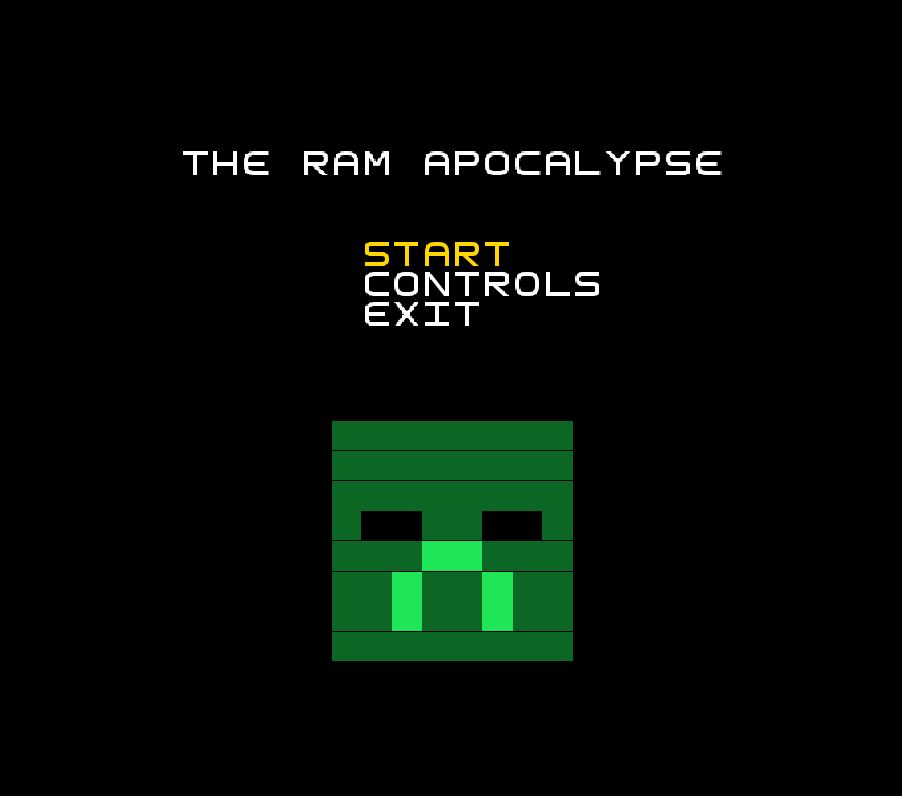
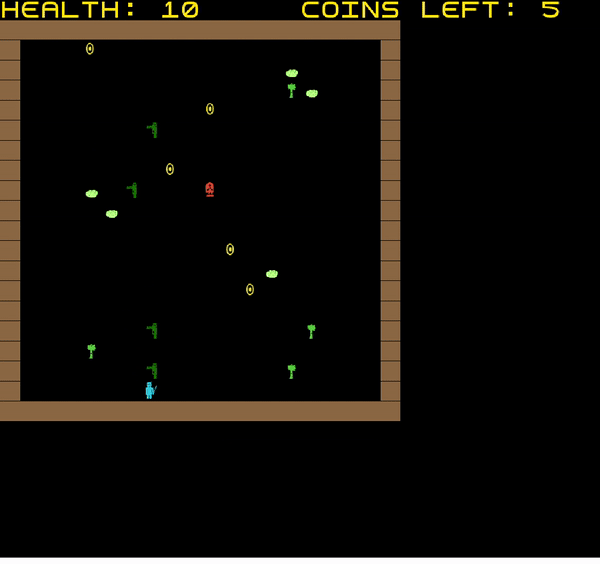

# LDTS_T16_G01 - The RAM Apocalypse

## Game Description

The Adventure of our survivor begins in the 11 realms of Madeira kingdom.Our brave survivor, where he will try to eliminate every Zombie that torments this beautiful Kingdom.To do so his mission is to find and acquire the infamous nuclear launch codes,11 to be more precise, each in every scary and dangerous realm,when all 11 codes are collected a secret nuclear missile will strike Madeira Kingdom, destroying all evil forces and restoring peace to our kingdom again!
During his journey, the survivor will need to collect all coins from each realm in order to collect the code and move on to the next realm.
We hope you enjoy your adventure through the world of RAM.

This project was developed by João Diogo Nunes Cruz (up202006731@fe.up.pt), Afonso Gouveia Dias(up202006721@fe.up.pt) and Francisco Lopes Mendonça(up202006728@fe.up.pt).

For a more detailed version of this description click [here](./docs/README.md).

## Screenshots

The following screenshots highlight the features our game:

### Game Preview

   

  <b><i>Fig 1. GamePreview </i></b>

### Menus

   

  <b><i>Fig 2. Main Menu </i></b>

 
 

   

  <b><i>Fig 3. Controls </i></b>

 
 

   

  <b><i>Fig 4. Game Over </i></b>

 
 

   

  <b><i>Fig 5. GameOverGif </i></b>

 
 

   

  <b><i>Fig 6. Win screen </i></b>

 
 

   

  <b><i>Fig 7. Win screen gif </i></b>

