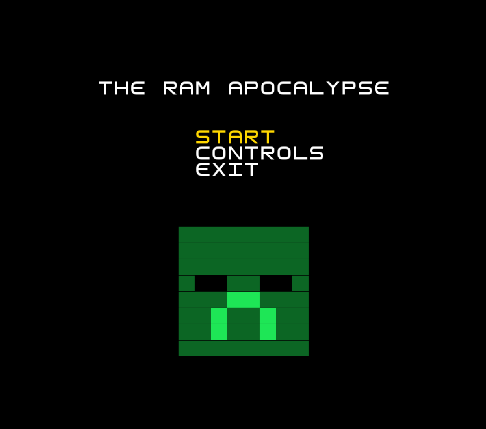
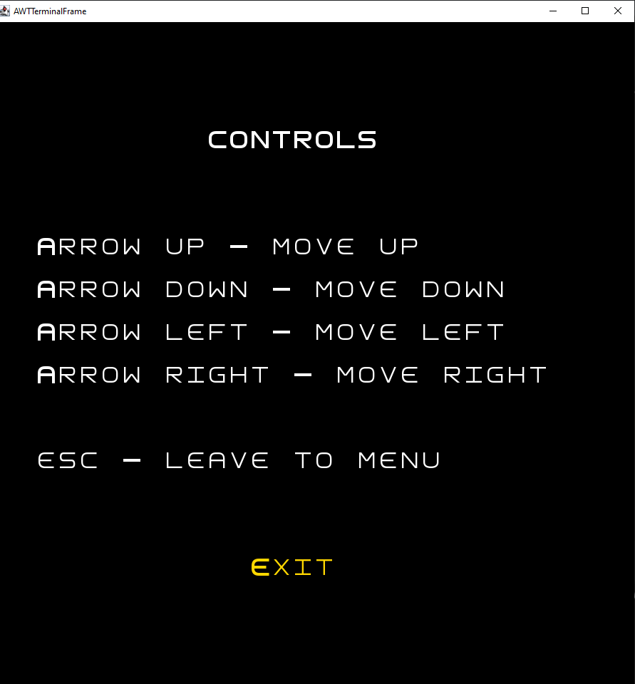
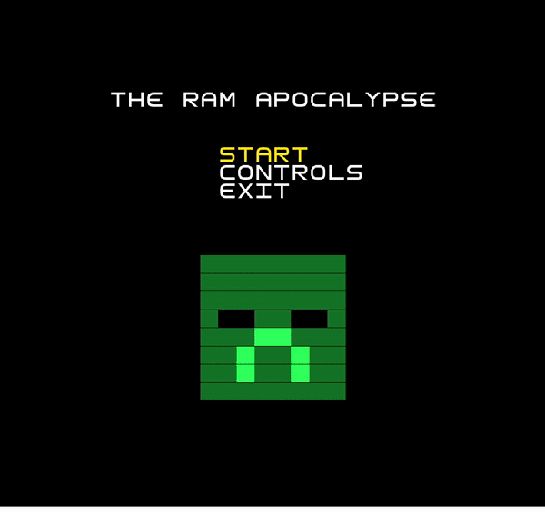
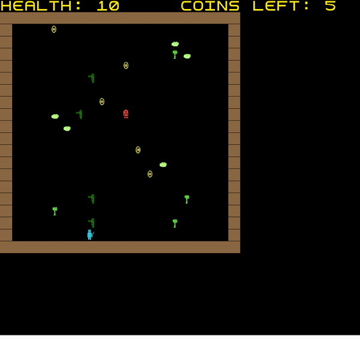
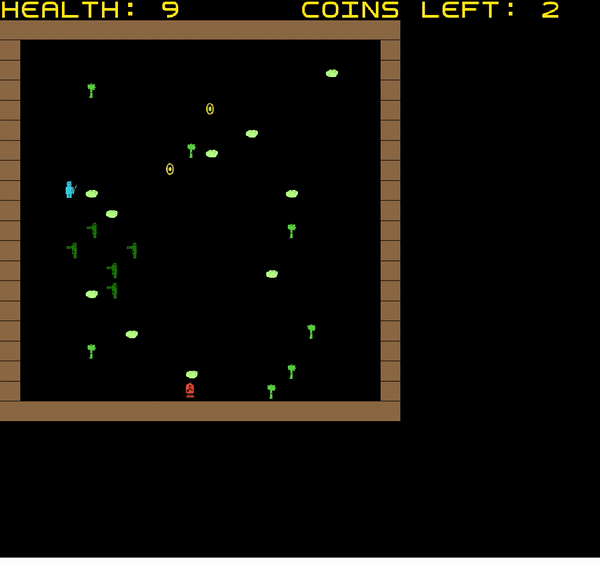
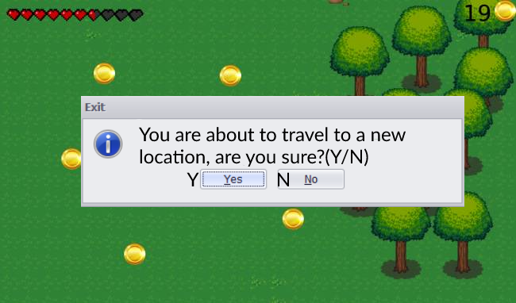
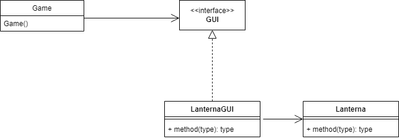
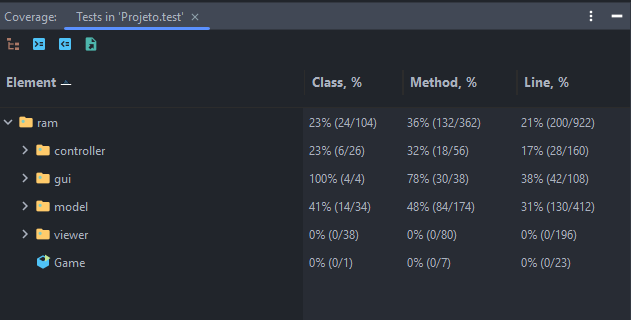

# LTDS_<16><01> - **The RAM apocalypse**

## **Game Description**

The Adventure of our survivor begins in the 11 realms of Madeira kingdom.Our brave survivor, where he will try to eliminate every Zombie that torments this beautiful Kingdom.To do so his mission is to find and acquire the infamous nuclear launch codes,11 to be more precise, each in every scary and dangerous realm,when all 11 codes are collected a secret nuclear missile will strike Madeira Kingdom, destroying all evil forces and restoring peace to our kingdom again!
During his journey, the survivor will need to collect all coins from each realm in order to collect the code and move on to the next realm.
We hope you enjoy your adventure through the world of RAM.

This project was developed by João Diogo Nunes Cruz (up202006731@fe.up.pt), Afonso Gouveia Dias(up202006721@fe.up.pt) and Francisco Lopes Mendonça(up202006728@fe.up.pt).

## **IMPLEMENTED FEATURES**

- **Connected Menus** - The user has the capability of browsing through the main menu, the game itself and the controls menu.
- **Buttons** - Functional and interactive buttons.
- **Keyboard control** - The keyboard inputs are received through the respective events and interpreted according to the current game state.
- **Player control** - The player may move with the arrow keys.
- **Collisions detection** - Collisions between different objects are verified. 
- **Different levels** - 11 different levels with an increasing difficulty were implemented.
- **Music** - implemented game music, with 3 diferent types for the winning screen, game over screen and game music.

> **Main ram.model.menu.MenuTest** - Starting screen for the ram.controller.game;

   

  <b><i>Fig 2. Main Menu </i></b>

 
 

> **Controls Screen** - User can check what the controls are before playing;

   

  <b><i>Fig 1. Controls </i></b>

 
 

> **Walking** - User can move his character freely,but will not phase through solid objects;

> **Zombies** - There are also zombies now and they will move in the player's general direction;

   

  <b><i>Fig 2. GamePreview </i></b>

 
 

> **Ending screens** - There are 2 screens, one for dying and one for completing all levels;

   

  <b><i>Fig 3. GameOverGif </i></b>

   

  <b><i>Fig 4. Win screen gif </i></b>

 
 

### PLANNED FEATURES  

- **NPCs** - Game levels will contain NPCs that will talk to you and inform you of the story. 
- **Hidden Loot** - In certain areas there could be hidden treasure.
- **Weapons** - There will be two types of weapons to choose from(Sword or Gun).

- **Controls mockup**

   

  <b><i>Fig 5. Controls Mockup </i></b>

- **GUI concept**

   

  <b><i>Fig 6. GUI Concept </i></b>

- **Exit Level prompt mockup**

   

  <b><i>Fig 7. Exit Prompt idea </i></b>

## **DESIGN**

### **Structure and States**

#### **Problem in Context**

The first concern of our project was how the structure would look like. Since our game is dealling with a GUI and is divided by different gameStates, after some thinking and researching it came to our mind to use the State pattern to deal with the different gameStates and Model-View-Controller to deal with the structure of our code, its usefull because of the nature of our project.

#### **The Patterns**

We have applied the **State** pattern. State is a behavioral design pattern that lets an object alter its behavior when its internal state changes. It appears as if the object changed its class. We used this design pattern to allow us to switch between diferent menus, we create a new state, in wich it creates a new menu(game, main menu, controls, etc.).  
Also we used the **Architectural style : Model-View-Controller(MVC)**, wich consists into dividing the code into 3 parts:  

- Model only represents the data.(Survivor,zombie, menu).  
- View displays the model data, and sends user actions to the controller.Draws the elements of each screen.  
- Controller provides model data to the view, and interprets user actions.

#### **Implementation**

The following figure shows how the pattern’s roles were mapped to the application classes.

##### **UML Communication Diagrams**

A UML communication diagram showing how classes communicate during a ram.controller.game step when the menu state is active or when the user selects an option:

A UML communication diagram showing how classes communicate during a ram.controller.game step when the ram.controller.game state is active:

#### **Consequences**

The use of the State Pattern in the current design allows the following benefits:

- We don’t need to have a long set of conditional if or switch statements associated with the various states; instead, polimorphism is used to activate the right behavior.
- There are now more classes and instances to manage, but still in a reasonable number.
- With the applied desing patterns we were able to comply with the first SOLID principle, the **Single-Responsibility Principle**[^1], each class has its own job and only one reason to change.

### **Realm builder and Loader**

#### **Problem in context**

Each realm as its own number of elements(survivor, bushes, zombies, coins, trees, walls...), so instead of having to construct every single level we decided to have a realm loader(LoaderRealmBuilder) to simply read from a existing file and comunicate to its super class(RealmBuilder) do draw the needed elements. With this implementation it becomes very easy to create new and different levels.

#### **Patterns**

The **Factory Method** and **Builder**, also used in this project, are two creational design patterns, the first one provides an interface for creating objects in a superclass, but allows subclasses to alter the type of objects that will be created. The second is a creational design pattern that lets you construct complex objects step by step, it allows you to produce different types and representations of an object using the same construction code, making a simpler code.

#### **Implementation**  

A factory is resposible for constructing the Realms(RealmBuilder). As for the implementation, the RealmBuilder is an abstract class which knows how to construct a Realm, however only its subclasses supply the necessary components of the Realm. The RealmLoader is one of referred subclasses that consists in a worker capable of reading different levels from different files. Another possible implementation would be a random loader that generates random components for the Realm. The builder pattern is implemented in all of the above classes by dividing the constructing in smaller steps.

#### **Consequences**

- You avoid tight coupling between the creator and the concrete products.
- Open/Closed Principle[^4]. You can introduce new types of products into the program without breaking existing client code.
- You can construct objects step-by-step, defer construction steps or run steps recursively.

### **Graphical User Interface (GUI)**  

#### **Problem in context**

Trying to create a structured and easy to change code, we tried to make it as general as possible, but the lanterna library contains various functions that aren't useful to our game. It breaks on of the SOLID principles, the **Interface Segregation Principle violation(ISP)**[^2]. Also, if using the library on its own, our game (high level module) would be directly depending on a low level module, this is a violation of the **Dependency Inversion Principle(DIP)**[^3]. A need to implement an interface that solves these problems was born.

#### **Pattern**

We have applied the **Facade** pattern. It is a structural design pattern that provides a simplified interface to a library, a framework, or any other complex set of classes, in wich we used to only include methods that only matter to our game and discard the things we wouldn´t be using.

#### **Implementation**

This diagram explains the implementation in our game:

#### **Consequences**

The use of the Facade Pattern in the current design allows the following benefits:

- Isolate code from the complexity of a subsystem.
- Promotes testability and replaceability.
- Expands lanterna functionalities as well as respecting the Interface Segregation Principle[^2].

#### KNOWN CODE SMELLS AND REFACTORING SUGGESTIONS

#### **Large Class**
Some classes (e.g. Game) contain many fields and others (e.g. GUI interface) contain many methods. In both cases, we find it justifiable as the classes require these fields, in one hand the Game class is the main class of the program and it needs to store a considerable amount of data, on the other hand various methods are needed for the interface and it wouldn't make sense to split it into two separate ones (extract method).

#### **Data Class**
All model classes are Data Classes, as they contain only fields, and no behavior (dumb classes). This is caused by the **MVC** (Model-View-Controller) architectural pattern which holds the responsibility to the controller to implement the logic functionalities of each model.
This is not a bad code smell because it only exits due to the chosen design pattern.

#### **Feature envy and message chains**
As the result of the **MVC** (Model-View-Controller) pattern some of the controllers use is narrowed to its model method calls. Our controller envies its model.
Also, in order to access a certain model's parameter it is mandatory to start by making a request to its controller.

#### **Long Method**
In some of our controller classes (e.g. SurvivorController and ZombieController) the step method is unreasonably long and difficult to understand containing multiple conditional statements and calls to model methods (e.g. getSurvivor.getHealth, getPosition, setPosition) as such it could be refactored using the decompose conditional method to simplify the readability of the methods down the line.

------

### **TESTING**

   

  <b><i>Fig 8. Tests Coverage </i></b>

- Click [here](./index.html) to find the mutation testing report

[^1]: A class should have one and only one reason to change, meaning that a class should have only one job.    
[^2]: A client should never be forced to implement an interface that it doesn’t use, or clients shouldn’t be forced to depend on methods they do not use.  
[^3]: Entities must depend on abstractions, not on concretions. It states that the high-level module must not depend on the low-level module, but they should depend on abstractions.  
[^4]: Objects or entities should be open for extension but closed for modification.  
### **SELF-EVALUATION**

We divided the work equally, each member doing its best and its part, while also helping the others, giving some insight in problems they were having.

- Afonso Dias: 33%
- Joao Diogo: 33%
- Francisco Mendonca: 33%
